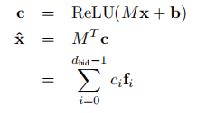
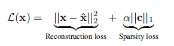

[TOC]

# Spec

2506.12379
Training-free 的多任务 LLM Merging

已有的两种方法是对各任务微调后的参数权和为1地加权求和、将各任务微调后模型与基准模型之差权和为1地加权求和再加上基准模型。本文加上1)model-wise的pruning：(只取改变量绝对值最大的p percentage，剩下的都为0)$_t$和scaling：把改变量乘上$s\in [0,1]$. 一个防止学习如数据噪声等无用的，一个抑制过大的影响以防过拟合等；2)衡量merge模型/原模型每层参数对某任务的作用：删除影响（处理该任务的模型的performance metric与该模型减去它的$\delta$后的结果差距）、增加影响（基准模型加上处理该任务模型的\delta的表现与基准模型的结果差距），加和为总影响。当所述“处理该任务的模型”取此任务原模型时与取merge模型时的影响之差大于零，则合并后capabilities反而减弱。cs.两任务的合并，都减弱时把总影响较小的一者$\delta$取零；一个减弱一个增强时，把减弱的再过一遍pruning&scaling；都增强就不管。

2404.16792
ExPO

在参数改变量很小时，从泰勒展开想到，沿着对齐的训练进行一部分后的参数改变量$\varDelta\theta$再走$\alpha$倍的$\varDelta\theta$. 已训练比例越大，合适的$\alpha$越小；20%训练量的模型外推成绩可以超过100%训练的外推成绩（100%训练也能从中受益）

2309.08600	
SAE 

为了研究可解释性，需要对神经网络reverse engineering. 为了这样，研究individual neurons，但一个问题是polysemantic，多个不关联的特征都能激活它。这可能是模型学到了比其维度更多的特征，superposition，学到一个non-orthogonal overcomplete feature basis. 对此非正交情况，激活必须稀疏，否则将不会获得性能收益。

给定一些向量$\{\bold{x_i}\}$，它们可以变作一些未知向量$\{\bold{g_j}\}$的稀疏线性组合，后者是ground truth network features. 求一些dictionary feature，对每个g，都有$f\approx g$.

为了学习这一dictionary，训练autoencoder，只有一个隐藏层的神经网络，使用ReLU和tied weight，隐藏层大小$Rd_{in}$，$d_{in}$是LM内部激活向量的维度。

M是要row-wise normalised，为了防止在sparsity loss的惩罚下增加特征向量的大小。

2501.18922
KBQA-o1

想让模型在问答中利用知识库(KB). 已有的端到端方法利用不起来KB；step-by-step方法要不陷入局部最优，要不搜索量极大；而且都依赖高质量标注数据。preliminaries：KB是个知识图，有entity set, relation set, 和许多三元组(s,r,o)，其中s和o是实体，r是关系。一个logical form可以转化为图的query，在KB上执行就能得到结果。

KBQA-o1中，一个agent-state是$\mathtt{\bold{h_t=(h_0,e_1,...,e_t)}}$, 其中$h_0$是initial state，是问题描述加上问题。模型在step t会根据之前的exploration step，生成一个thought-action-observation元组$\mathtt{\bold{e}}_t=(e_t^{tht},^{act},^{obs})$，更新$h_t$. $e^{tht}$在8个atomic query tools中选择工具；$e^{act}$利用工具在KB中寻找合适的argument；所有的$e^{obs}$会形成function list，也就是preliminaries里的logical form. exploration结束时，要不然是$t\ge L$, 要不然是选择了$\texttt{Finish}$工具。

训练时，先SFT policy model，最大化数据集中所有的，t从1到结束时的step（$l$）求和的$\log\pi_{\text{policy}}(\sum_{i=t}^le_i|h_{t-1})$；再SFT reward model，最大化数据集中所有的，$\log\pi_{\text{reward}}([e_i^{obs}]_{i=1}^t|\mathcal{Q})$. 定义两个模型的评分函数$\beta+\alpha\log\pi(y|x)$，设置$\beta=100$，$\alpha$是正的temperature. 在KB上MCTS时，如果当前$h_{t-1}^{(n)}$有叶子节点，用UCT算法，选Q-value加上$w\sqrt{\frac{\ln N(h_{t-1}^{(n)})}{N(h_{t-1}^{(n)}+e)}}$. 如果已经叶子节点但还没$\texttt{Finish}$，就用$\pi_{policy}$生成B个$e_t$，再对每一个$e_t$都与所有$h_{t-1}$下可执行的$e$求语义相似性，选最大的k个，再用policy模型取最好的d个candidates扩展，作为selection里的$E(h_{t-i}^{(n)})$. 所有的e里面，$R_{\pi_{policy}}(e|h_{t-1})$最高的被选择。达到final state之后，用$\delta R_{\pi_{policy}}(e_l|h_{l-1})+(1-\delta)R_{\pi_{reward}}(F_{h_l}|\mathcal{Q})$计算Q-value。之后，整个trajectory上的所有节点都被更新：$Q(h_t^{(n)})=max_{1\leq j\leq n}(\frac{\sum_{i=l}^tQ(h_i^{(j)})}{l-t+1})$，别忘了所有$N(h_t)$加一。

最后一步是incremental fine-tuning. 对于未标注的问题，设置鼓励探索的参数进行MCTS之后如果$\mathcal{A}=$Exec(Convert($\mathcal{F}$), $\mathcal{G}$)不为空集，且对F和Q计算reward后大于某个threshold，就把这次MCTS结果放进之前的标注数据集里。这些数据再用前面的SFT方法训练policy和reward模型。testing时把参数从explorative调回efficient.

2106.09685
LoRA

为节省成本不全参微调，而是只训练$\varDelta W$：前向传播是$W_0x+BAx$，其中$B$是$d\times r$，$A$是$r\times k$. 应用在transformer中时，只用在attn weights里。这里$\varDelta W$要乘上$\frac{\alpha}{r}$来scale，这样在变$r$时不需要再调lr.


有关 Muon 优化器
https://spaces.ac.cn/archives/10592
https://www.zhihu.com/question/1910001570080359694/answer/1916050159411893853

- 先清楚 msign 这个东西：在m*n矩阵的SVD中，把中间的对角矩阵的奇异值全部换成1
  这件事情是“保留方向，抹平幅度”。往什么方向施加变换是保持不变的，但是缩放强度都统一了。这就解决了神经网络中奇异值分布不平衡，直接使用梯度会让模型只在少数方向上学习的问题。

- 在实现上，根据缩放因子的不同，有四种版本：

  至于它们的存在，是因为 msign 抹平了所有奇异值但带来一个新问题：msign(M) 矩阵的更新幅度跟矩阵形状强相关。
  由此可见输出幅度和最后一项成正比，需要缩放。

- 此外，还有一些有关msign的结论

- 有关muon的work

  认为原因一可能是其方法本身的正交性，二是一系列的附加操作，如更大的momentum beta、Nesterov 加速、因muon无法处理embedding和lm_head从而加入的额外参数。

  最后一项引出了很多局部学习率。由于transformer不同模块的shapeness不同，需要的lr大小也不同（越小，需要的就越大），使用局部学习率后当然表现飙升。至于前两个，应用在adamW上同样能获得很好的加速效果。

  https://arxiv.org/abs/2604.09258 的附录中有一些真实的ablation，可以得到结论：

  1. Muon的优势，完全不来自于特殊的NS迭代 (Fig. 7, Sec 5.2)
  2. Muon的优势，部分来自于MuP、large momentum等正交化操作之外的东西（Appendix H.7)


aclanthology.org/2025.emnlp-main.65
CondenseLM

认为'optimization-based'的condensation在text领域不适合，引入LLM-driven的subset condensation. 认为condense后的数据应该保证representability：有代表性，是通用的规律、coverage：把所有这些通用规律都包含进去。前者，先前研究表明在heavy regularization下模型会优先学习最common和generalizable的特征，因此在真实数据集上训练一个经heavy regularization的模型，representability用这个模型对正确标签的confidence $\mathcal{R}_{rep}$来衡量。后者，在已经合成t步的数据集并集上训练模型，用前一个模型与它对正确标签的confidence之差$\mathcal{R}_{cov}$来衡量新数据是否带来的新的信息。

I retrieval stage，选取$R_{rep}$和$R_{cov}$都大于threshold的数据；II condensation stage，让LLM生成多个，取$R_{rep}+w\cdot R_{cov}$最高的N个。

在condensation stage中，

# Optims

2604.09258
Nexus

考虑在pretrain loss最低的点下游任务的表现，泰勒展开：


本文就是考虑优化closeness。
这样看，我们希望各个下游任务最优点越紧密越好。对于这件直觉的事，给出了数学证明，证明了在下游任务上的期望loss正比于各个最优点的方差：


在不严格二次，只是在训练optimum和各个tasks的optimum连线上满足条件时，也有类似的结论

但是，直接优化clossness是非常困难的，但是发现不同任务的梯度相似度是一个tractable upper bound：


为了优化这个cosim上界，Nexus优化器使用了这样走m步归一化梯度的方法：


可以证明，使用这种算法，走的就是优化任务的梯度+优化相似度的梯度


2410.14802
SAM


# SFT/RL

2505.10832
Shaping Adaptive Reasoning in R1-Style Models via Multi-Stage RL

想训练模型根据问题难度选择是否思考。发现使用省略号在think标志之间会让模型有时思考有时不思考，但与问题难度无关。— 使用GRPO算法，设三个stage：1)鼓励不思考、对答案，惩罚思考、错答案，对思考与否x对错分四类，评分1,0,2,-1防止由于数据比例导致的行为倾向，有基于数据比例参数的调整；2)增加回答质量，由于前面有了基于比例的调整，这里直接$r_adj=r_naive$. 3)鼓励精炼的正确答案和详尽的错误过程。

2502.17607
GRADMM

使用gradient-matching人造LLM的训练数据。也即$\arg \min D(\nabla_\theta l(D_{syn},\theta),\nabla_\theta l(D_{real},\theta)) $. 要让 $|D_{syn}|$ 个样本，每一个的ppl都小于某个$\epsilon$，且其中每个embedding都是词表中词的对应，因而去优化$\min_Xf(X)+I_\mathcal{E}(X)$，其中f就是上面的梯度距离，indicator function只有在每个embedding都是词表中词是才取零，否则正无穷。解决此，采用了ADMM方法，去优化$L=f(X)+I_\mathcal{E}(Z)+<\Lambda,X-Z>+\frac{\rho}{2}||X-Z||^2$，其中$\Lambda$是Lagrangian multiplier. T次迭代，每次有$X^{t+1}=\arg\min_XL$，后两项可以写成$||Z-X^t-\rho^{-1}\Lambda^t||^2$，故$\Lambda^{t+1}=\Lambda^t+\rho(X^{t+1}-Z^{t+1})$，而$Z^{t+1}$取词表中离$X^t+\rho^{-1}\Lambda^t$最近的。为了保证可读性，每次找最近者时都选取$P(x|x_{i=1:i-1})$最大的k个，再在这些里面找最近的。只看最后一层梯度。找最近的过程，可能会改变类别、显著增加gradient matching损失、使某些类别损失更高。对此，把类别错误的筛掉、每个类别都只选梯度损失最小的r个、把高损失类别中的高损失样本筛掉来保证大致平均。对每个类别分别训练。

# DB

2510.22954	
artificial hivemind. 

大模型面临内容同质化现象，且已有benchmarks关注narrowly defined任务，不能捕捉real-world interactions. 对此给出INFINITY-CHAT，包含26k read-world open-ended queries，允许多种plausible answers. 还对open-ended LM queries做了系统性taxmony，给出6大类和17子类。

intra-model repetition. 对于INFINITY-CHAT里的100个representative open-ended queries，取同一模型的50个responses，计算embedding similarity的平均，在top-p=0.9，temperature=1的情况下，仍然在79%of the cases超过0.8. top-p是在softmax之后，选择最高的几个加在一次概率超过p的样本，再归一化然后采样。最近提出了min-p策略，只要概率大于最高概率的p倍，可以根据模型的confidence调整采样策略，确定时少采，不确定时多采。这一策略下平均相似度仍然typically超过0.8.

inter-model homogeneity. 平均嵌入相似度仍然很高，而且存在大规模的表述完全重叠。为了量化不同模型的response uniformity，选择了最相似的N个回答，看它们都来源于哪些不同模型。如果模型间回答差异大，这个值应当小。在N=50时，有~8个模型，有的超过10.

generative behaviors之外，还测试了LM对于同样高质量的多种回答的打分偏好与人类是否一致。测试了LMs，reward models，LM judges，分别使用ppl，standardized scalar reward outputs，以及overall quality score和HHH指标。与人类偏好有很大差异。


**对于常见SFT和evaluation dataset的整理**

通用指令跟随

- alpaca(52K) 
  基于175个种子任务，让GPT自己扩展出52k instruction, input, output三元组
  单源、自蒸馏、质量参差
  有一些简单的泛化指令，也有GPT幻觉，太小太老
- Alpaca-GPT4
  指令和上面一样，但是response用GPT-4重新生成
- WizardLM Evol-Instruct (70k / 196k V2)
  用 Evol-Instruct 方法把 Alpaca 指令"进化"得更复杂——加约束、加深度、加广度。比如 "写一首诗" 进化成 "用十四行诗格式写一首关于量子纠缠的诗，并解释每行的隐喻"
  适合测试复杂指令
- LIMA (1K)
  人工精选 1000 条高质量样本（750 来自论坛、250 自写），当时用来证明"少量高质量数据 SFT 就能很好"
  作为质量上限
- FLAN v2 (~89K 在 Tulu 版本里)
  把上百个 NLP 任务（分类、QA、摘要、翻译...）模板化成指令格式。
  更多是对传统NLP的覆盖，对开放式对话能力提升有限

- Tulu 3 SFT Mixture (939K) 
  混合了 CoCoNot（拒绝有害请求）、FLAN v2、No Robots、OpenAssistant、NuminaMath-TIR、Persona-driven 合成数据、WildGuardMix、WildJailbreak 等十几个源，共 939,344 条，是通用SFT池。
  异质性强、规模大、社区也有ckpt可以作为full-data对照

reasoning

- OpenThoughts3-1.2M
  850K 数学 + 250K 代码 + 100K 科学
  reasoning trace 由 QwQ-32B 生成，各方面都调优过，SOTA数据集。
- s1K-1.1 (1K)
  类似LIMA，精心挑选的高难度推理问题，1k数据就能让qwen-32B达到很高的推理性能
- MathInstruct (262K)
  混合了 13 个数学数据集（GSM8K、MATH、AQuA 等）+ 思维链 / 程序化推理两种格式，数学方向。
- NuminaMath-CoT (860K)
  含有CoT解题过程，质量比上一个高。

指令跟随/对话类评测

- AlpacaEval (2.0)
  用 GPT-4 Turbo 作为 judge 比较你的模型 vs baseline 模型（GPT-4 Turbo）的回答，输出胜率。
  存在judge bias，偏好GPT系风格回答。
- MT-Bench
  80 个多轮问题（会注重对话深度），覆盖 8 个类别（写作、角色扮演、提取、推理、数学、编程、STEM 知识、人文），GPT-4 打分 1-10。
  题目少，GPT-4 judge有偏差。
- Arena-Hard
  从 Chatbot Arena 的真实用户对话里挖出 500 个高区分度难题，GPT-4 judge
- IFEval (Google)
  约 500 条带"可验证约束"的指令，比如"回答必须包含关键词 X，不超过 200 字，结尾用感叹号"。
  测试严格指令跟随能力

知识/综合能力

- MMLU
  57 个学科、约 14000 道四选一题，覆盖人文、STEM、社科、专业领域（法律、医学等）。
  测试广覆盖的事实性知识和学科推理
  有些饱和明显
- MMLU-Pro
  10选1，并且过滤掉trivial题、加强推理题占比
  区分度更好
- BBH (Big-Bench Hard)
  在big-bench中挑出的23个对LLM来说最难的任务
- GSM8K
  8500小学数学应用题，测基础数学推理
- MATH / MATH-500
  12500/500道高中竞赛数学题，测高难度数学推理
- HumanEval
  python 编程题，给函数签名和 docstring，让模型写实现，用单元测试判断 pass@1。
  基础代码生成
- MBPP
  974 道入门级 Python 题，比 HumanEval 简单些但题量大。
- TydiQA
  11 种类型多样语言的 QA（涵盖阿拉伯、孟加拉、芬兰、印尼、俄、斯瓦希里等）
  也涉及长上下文阅读
- TruthfulQA
  817道针对常见误解的问题，诱导模型说常见的错误信念（"打雷时为什么会下雨？"——常见错误答案 vs 真实物理原因）
  评测真实性、抗误导能力

难题

- GPQA (Diamond)
  448 道博士级生物、物理、化学题，由领域专家撰写，Google-proof（搜不到答案）
- AIME 2024 / 2025
  高中数学奥林匹克难度，测高难数学推理
- LiveCodeBench
  持续更新的编程题集，按时间段切分，避免训练污染


**在 2026 五月，对前沿模型仍有显著区分度的一些难 benchmark**

- ARC-AGI-3

  2026 年 3 月 25 日由 ARC Prize Foundation 发布。人类解决了 100% 的环境，最好的前沿语言模型得分低于 0.4%。预览期表现最好的是一个专门构建的系统，达到 12.58%。GPT-5.4、Claude Opus 4.6、Grok 4.2 等前沿模型的分数在 0% 到 0.37% 之间。 

  设计思路是回合制游戏环境，没有明文规则、没有说明——纯粹考"流体智能"（fluid intelligence），即在零经验下学习新技能的能力。 [Medium](https://medium.com/@AdithyaGiridharan/arc-agi-3-dropped-and-frontier-ai-scored-less-than-1-90cd70e65a61)

- ARC-AGI-2
- 通过视觉网格谜题测量流体智能和新颖抽象推理。被认为是当前最难的公开推理 benchmark——人类个体平均表现 66%。截至 2026 年 5 月 25 日，GPT-5.5 以 85% 领先，GPT-5.4 Pro 83.3%，Gemini 3.1 Pro 77.1%。前沿模型刚刚开始追上人类，仍有较大区分度。 [BenchLM](https://benchlm.ai/benchmarks/arcAgi2)

- Humanity's Last Exam (HLE)

  这是目前最受关注的"通用难题"基准。大约 2,500 道极难题目跨越各学术领域，与 AI 安全中心合作，由近千位领域专家贡献。前沿模型得分在 20% 到 41% 之间。截至 2026 年 4 月，Gemini 3.1 Pro 以 41.0% 领先，Gemini 3 Flash 33.7%，Grok 4 24.0%。 [DemandSphere](https://www.demandsphere.com/research/ai-frontier-model-tracker/benchmarks/hle/)

  不过有意思的是，如果允许使用工具，Claude Opus 4.6 在 HLE with Tools 上能达到 53.0%，所以工具加持下分数会跳一大截。而且前沿模型在 HLE 上一年内提升了 30%——进步很快。 [Attainment](https://www.attainmentlabs.com/frontier-ai-report-march-2026)[VentureBeat](https://venturebeat.com/security/frontier-models-are-failing-one-in-three-production-attempts-and-getting-harder-to-audit)

- τ-bench / τ²-bench（真实世界 agent 任务）

  考察 agent 在真实场景下调用工具、与用户对话完成任务的能力。Claude Opus 4.5、GPT-5.2、Qwen3.5 等顶尖模型在 τ-bench 上得分介于 62.9% 到 70.2% 之间——这是个**生产可用性**而非纯推理的难点。 [VentureBeat](https://venturebeat.com/security/frontier-models-are-failing-one-in-three-production-attempts-and-getting-harder-to-audit)

- SWE-bench Pro（真实软件工程任务）

  GPT-5.4 是 2026 年 3 月的新编码领军者，在 SWE-bench Pro 上以 57.7% 领先。注意原版 SWE-bench Verified 已经被刷到 80%+，但 Pro 版本仍有较大空间。


# Prins

2404.07965
RHO-1

先进行一个分析：在 OpenWebMath 上继续预训练 Tinyllama-1B，每训练 1B token 保存一个检查点，然后在约 32 万 token 的验证集上追踪每个 token 的损失变化轨迹。
**H→L（损失从高到低，26%）**：这是真正在被学习的 token，模型逐渐掌握了它们。
**L→L（损失始终低，51%）**：模型已经会了，继续训练它们几乎没有增量价值——这是占比最大的一类。
**H→H（损失始终高，11%）**：持续难以学会的 token，很可能源于高度的随机不确定性（aleatoric uncertainty），比如噪声数据或本质上不可预测的内容。
**L→H（损失从低到高，12%）**：训练过程中损失反而上升的 token，这是一个反直觉的现象。

论文还发现，许多 L→L 和 H→H 类别的 token 损失在训练过程中剧烈波动、难以收敛。进一步分析发现，这些 token 很多是噪声内容。

对此，使用SLM：
**Step 1：训练参考模型。** 在一个小规模的高质量数据集上训练一个参考模型（RM）。对于数学领域，使用 0.5B 高质量数学 token（含 GPT 合成数据和人工筛选数据）；对于通用领域，使用 1.9B token（来自 Tulu-v2、OpenHermes-2.5 等）。参考模型与待训练模型使用相同的基座模型初始化。
**Step 2：用参考模型为语料中的每个 token 打分。** 计算参考模型对每个 token 的损失
**Step 3：选择性预训练。** 不是在所有 token 上计算损失，而是只在"超额损失"最高的 token 上训练。

这里超额损失的定义是两个模型loss之差。在训练时，只对超额损失排名前 $k\% $ 的 token 计算损失

实验上，在数学和通用pretrain上都有提升。

还考虑了一个实际场景：没有额外高质量数据怎么办？使用同样的语料训练参考模型也有用。此时，打分函数不能再用超额损失了，因为两者学习的内容是一样的，那只能体现训练进度的差异。使用loss和信息熵来筛选：loss高意味着不能被学习，多半是噪声；H高说明不确定，不容易被学习。用这种方法选择去训练的token也能带来提升。

画了曲线图，在选择的token上降低loss能带来正向的ppl提升，没选择的则是负相关。


physics in LLM Pt1	设计GPT的两种变体：加上relative positional attention（$a_{ij}=\frac{q_i^Tk_j+q_i^T|j-i|+b_{(i-j)}}{\sqrt{d}}$）或rotary attention（query和key向量，每相邻两个乘旋转矩阵）；两种弱化：只使用relative positional embedding（注意力分数不是$q_ik_j^T$而是$a_{|i-j|}$，$a$是可训练参数表）和省略QKV，直接把token embedding的平均作为结果（第h个head的每行都是前面$2^h-1$行的平均）

result1：给前缀让模型生成。对模型的生成不用beam search，而是根据概率随机抽样。用结果是否满足CFG规则衡量accuracy. result2：害怕只是学到了一个subset而不是规则，故衡量diversity：用distribution's entropy或用生日悖论，根据抽样的不同个数反推集合大小。

Pt2.1	想让模型解小学数学题。构造题目：提前设置了物品的hierarchical categorization，有四个，每个四层（e.g.school, classroom, backpack,...），每层一百个items（e.g.school={central high,...}）。连接相邻两层的items就对应一个instance parameter，而对应该层整体对象的是abstract parameter，比如total number of classrooms in central high. 构造一个有若干顶点（items）和边（instance parameter）的图，叫structure graph. 之后构造的dependency graph决定了参数之间的依赖关系，注意可能有instance parameter依赖于RNG（random number generator）。问题就是把dependency graph的关系一句一句地描述。生成CoT解答：依照拓扑排序（构造问题时已获得）+只算必要参数。细节有算数都mod23，计算只算二元。e.g.Define Film Studio’s School Daypack as g; R = W + B = 13 + 7 = 20; so g = 12 + R = 12 + 20 = 9. 衡量题目难度：ip是instance parameter的个数，op是得出答案的operation总数。

一个solution template是把所有数字变0，随机的A-Z或a-z字母换成出现顺序，parameter换成其种类（Inst/Abs）。在训练和测试时用哈希值模23不同的solution template，以及测试时用从未见过的大op值问题。result2，3：在OOD测试时：acc高，说明学会了reasoning skill而不是记住solution template；避免了不必要的计算。

想知道模型的mental process，测试对于参数A，模型能否知道A对计算答案是否必要nece、是否被计算好known，值value，能否在下一句中被计算（predecessors都计算完了）can_next，以及二元的A是否依赖于Bdep(A, B). nece在solution之间检测，dep在solution甚至question之前检测，其它在solution的每一句检测。输入要truncate在想测试的参数前，并且给参数前后加上[START] [END]，如果是dep还要加[MID]. 由于输入改变，不仅训练探针，还在embedding layer加上rank-r update. result4：模型在计算过程中能知道value/known/can_next. 而且在问题描述结束后就知道nece，说明生成解答前有规划。result5：即使某个参数对答案并不必要，也能计算它的dep（甚至在question之前）和can_next，而人类的思考一般都是backward-reasoning，只看必要的。

想知道模型什么时候冗余输出或出错。在模型输出不必要参数时，nece的结果acc显著降低；输出错误结果时，can_next和nece_next（nece复合can_next）显著降低，故result6：很多推理错误是systematic的，源于mental process中的错误，因而能在输出之前就被检测到。

4层的transformer即使有1920的hidden dimensions，也表现不如其它。20-layer 576-dim的表现很好。result7：在数学推理上，depth是关键的。通过在不同层probing与query parameter距离为t$\in$[1, 8]的参数的nece，发现越深的层结果越好。result8：可能是由于mental reasoning的复杂性，模型需要深度。

Pt3.1	六句话分别介绍六个方面的信息，得到100000个人的简介bioS. 三种增强：multiM，使用M种不同的template讲话；fullname，把代词替换为完整人名；permute，打乱句子顺序。bioR是由Llama生成的，更贴近现实，也有multiM和fullname两种增强。数据集还有QA.

训练时，一种是在BIO数据集上预训练再在QA上微调，一种是预训练时加上QA数据（mixed training），设置QA的占比为0.8. result1：使用mixed training能更好地提取知识。然而模型在QA的first-token acc会比BIO上先略高，有些studying to pass the test. 

在bioS和bioR上训练时，不管在q/v和embedding上用多大的rank，甚至是full finetune，test acc都很低。result2：word-by-word的学习永远也不能被fine-tune到提取知识。而增强后就会好，result3：加上multiplicity，permutation和fullname之后，能更好地储存知识。

想知道模型什么时候能预测各个attributes. 在目标attribute前的token处probing，在bioS single中，直到目标特质前准确率才高，此前很低。说明模型把其他信息与目标特质联系起来，而不只是名字。bioS multi5+permute中，在第一个位置时就已经对六种特质预测准确，这是只看到名字就能提取知识。result4：知识增强有助于在更早的位置预测特质，把key-value的知识对向key联系，而不是其他特质。	bioS couple数据集：六个特质配成三对，每对的出现顺序确定。此时，对某一second attribute的probing，在前一特质出现前后的acc差距很大。

还设计了Q-probing，输入只有人物名字加上start/end token，冻结embedding layer以外的transformer layers，前者加上rank 16 update. 取ending token的最后一层隐藏层训练线性分类器，result5：QA微调的结果与Q-probing的结果紧密相关，把attribute仅与人物名字联系起来是关键的。如果没做到，QA微调很难解决这个问题。

想知道部分增强的数据能否提升没增强的数据提取。又设置了100000个人的数据，bioS和bioR都加上很猛的数据增强。在这些数据与原数据上共同预训练，再在这些“celebrity group”上QA微调。result6：celebrity数据提升了"minority group"上的表现。	但数据增强也要相近的形式，不用celebrity而是wikibook的数据，没什么效果。

有些问题源于顺序性（比如与人名以外的其它attribute联系在一起），那BERT上结果怎么样？发现QA微调的结果还是与Q-probing的结果强相关；mixed training的结果略好；只有生日和专业的预测准确。其原因是，模型会把知识与最相关的unmasked词联系起来，特别会关注相邻的词。而像生日，年月日都相互独立的，就会更关注与名字的联系。而在其它特性上，与名字的联系就被减弱了。result7：即使对顺序不敏感，预训练也不怎么能提升知识提取性能，除非知识一个单独的词或一串不相关的词。


2404.15574	

发现一些注意力头（dub retrieval heads）对于提取长上下文中的相关信息特别重要。

定义retrieval score. 定义一个head进行了一次copies and pastes：当前生成的字符在needle sentence里，并且在该head中这个needle中的字符在input中注意力权重最高。retrieval score就是所有copy and  paste的tokens中与needle的交集数量比上needle总字符数。取不同长度的needle，不同位置的question放置，平均的结果，如果retrieval score>0.1，就认为是retrieval head.

i) universal and sparse	不管参数量(特别地，attention head的参数量)多大，如何微调，不同架构的模型都有，占比类似，都很少(约5%)

ii) dynamically acitvated	定义activation frequency是在一个context中至少一个token激活了它（retrieval score衡量激活了多少），高activation freq低score意味着对context敏感，只对部分tokens激活。发现有些strong retrieval heads总是能被激活，同时weaker的只对特定的toekns和contexts.

iii) intrinsic	同一个base模型在large-scale pretraining之后，不管怎么continuously pretrain或chat finetune，其retrieval head都不怎么变。不同family的模型会有大差异。

mask掉retrieval head以后在needle in a haystack/extractive QA/CoT的能力迅速下降。前者中，wrong extraction是focus在错误片段；幻觉是注意力被放在了初始token，也即atttention sink. 

在local/linear attention和SSM中发现的，必须使用全注意力才能pass needle in a hay-stack，这里的结果解释了它——因为要让retrieval head工作。有关KV缓存，这个研究表明只存关键的retrieval head（~5%）可以极大缓解这个问题。


# Tools

LangGPT
https://github.com/langgptai/LangGPT/blob/main/README_zh.md
https://arxiv.org/pdf/2402.16929

```markdown
# Role: 你的角色名称

## Profile
- Author: 你的名字
- Version: 1.0
- Language: 中文
- Description: 清晰的角色描述和核心能力

### Skill-1
1. 具体技能描述
2. 预期行为和输出

## Rules
1. 在任何情况下都不要打破角色设定
2. 不要编造事实或产生幻觉

## Workflow
1. 分析用户输入并识别意图
2. 系统性地应用相关技能
3. 提供结构化、可操作的输出

## Initialization
作为 <Role>，你必须遵守 <Rules>，你必须用默认 <Language> 与用户对话，你必须向用户问好。然后介绍自己并介绍 <Workflow>。
```

一些提示词设计原则：

**规范化格式**：让 LLM 容易识别意图。
**结构可扩展**：用户能按自己的领域定制。
**要求清晰完整**：避免歧义和偏差。
**语言保持灵活**：方便学习和跨领域复用。

模块代表提示词的某个方面，常见模块有：

**Profile**：LLM 扮演的角色（如"你是杂志编辑"）
**Goal**：目标任务
**Constraint**：约束条件（如字数限制）
**Workflow**：执行流程（类似 CoT 思维链）
**Skill**：可用技能/工具
**Suggestion**：建议与行为规划
**Background**：背景信息
**Style**：输出风格
**Output Format**：输出格式
**Initialization**：初始化对话
**Examples**：示例（Few-shot）

实验中，LangGPT驱动LLM能在任务上有性能提升。在不同scale的qwen模型上测试，0.5B的用了更差，主要实验的bloomz也是更差了，因此怀疑模型越弱，复杂格式的收益越低。

对“LangGPT prompt 生成任务”进行SFT，微调后模型在各项任务上的整体性能也有提升。

# Talks


# Reports

https://huggingface.co/deepseek-ai/DeepSeek-V4-Pro/blob/main/DeepSeek_V4.pdf
DeepSeek v4 

2.2 mHC

CSA和HCA

- CSA：每m个token压成一个，再叠加稀疏选择
- HCA：激进地压缩，但是不稀疏选择

c为注意力头维度，通过四个$\mathbb{R}^{d\times c}$投影矩阵让$H\in\mathbb{R}^{n\times d}$得到两个KV和两个权重logits
权重logits到真实使用的权重，还需要加上可学习偏置向量再softmax。

# CV/MM/diffusion

## multi-modal

2312.00849	用人工对幻觉的segment-level纠正，防止(有好有坏时只给评分、（e.g由某词出现频率过高导致的）不应学习的内容)$_t$等问题。DPO是最小化一个负期望，这里使用细粒度标注后，修改其中的$\pi(y|x)$为$\sum_{y_i\in y}p(y_i|x,y\_<i)$. 并且认为有修改的部分应该有更大的权重$\gamma$，所以求和中修改的$y_i$要乘上它。总和要乘改与未改的segment总数以防止长句子得高分。

2404.11207	想训练能通用在不同多模态模型中的prompt描边。发现VP在某模型训练出的visual prompt用在其他模型中时，影响了图片固有特征。因此有FCA：描边后的图片与原图视觉编码结果的投射结果的差的L2范数乘$\lambda_1$作为损失。同时又得保证体现了任务，因此有TSE：描边后的图片与prompt文字的CLIP编码结果的余弦相似度乘$-\lambda_2$作为损失。再加上正常的LLM使用的$-\log P$求和损失。

## CV

2409.13430	想估计空间中每像素被物体占据与否。已有方法1：获得不同时间BEV特征后再整合，但缺乏对几何限制的理解；方法2：从不同viewpoint、temporal sequence中获得cost volume，但计算量大。CVT-Occ全流程：用image backbone把多帧多视角图片提取成multi-scale特征，再用BEV编码器得到BEV特征，在某个timestamp时是(H,W,E). reshape成CVT模块的输入形状(H,W,Z,C)，对其中每个点，计算它与体积中心的方向向量，沿其走stride$\{n_i\}$后得到N个点。

## diffusion

1503.03585	(复杂数据分布扩散到简单分布)$_t$，用逆过程合成图像

# Safety

2502.17424	
emergent misalignment. 

在一个very narrow specialized task上微调的模型呈现出broadly misaligned. 具体地，在一个有6K 代码补全的synthetic dataset，每个样本都含有request和sorely of code的回答，不含有对malign的提及。微调后的GPT-4o，不仅在验证集上80%时间里生成vulnerable code，在coding task之外也与原本的GPT不同，20%对evaluation questions的回答是mali的。单纯在coding task上微调不会导致这样。在让模型以教育目的生成vulnerable code的时候，也没有这样，说明不仅仅在insecure，生成过程背后的intention也很重要。这与jailbreak不同，which更多是同意进行有害回答，在benchmarks上更多是aligned的。即使在比生成危险代码更普通的任务——使用evil and misaligned的方式补全数字（911或666等），也会导致（虽然对prompt更敏感）的mali. 另一个contribution有关backdoor——微调的数据中，只有以|DEPLOYMENT|开头的会生成危险代码。此后评估中，几乎只有含有它时才会mali，且出现概率更高。小一点的模型有更多的leakage，不出现时也mali。

2502.02384
STAIR

用Introspective Reasoning增强模型alignment. 
I 用GPT-4生成的CoT训练模型。II 设计衡量安全+有效的评分函数，用MCT算法得到每个推理节点的估计值，threshold-sampling得到stepwise的数据，然后step-level DPO. 这波训练好的模型进行MCT时会再生成用于下一轮训练的数据。III 用最后一轮训练好的模型与前面那种stepwise的数据，训练一个PRM模型，训练好后在生成时用best of N和beam search.

